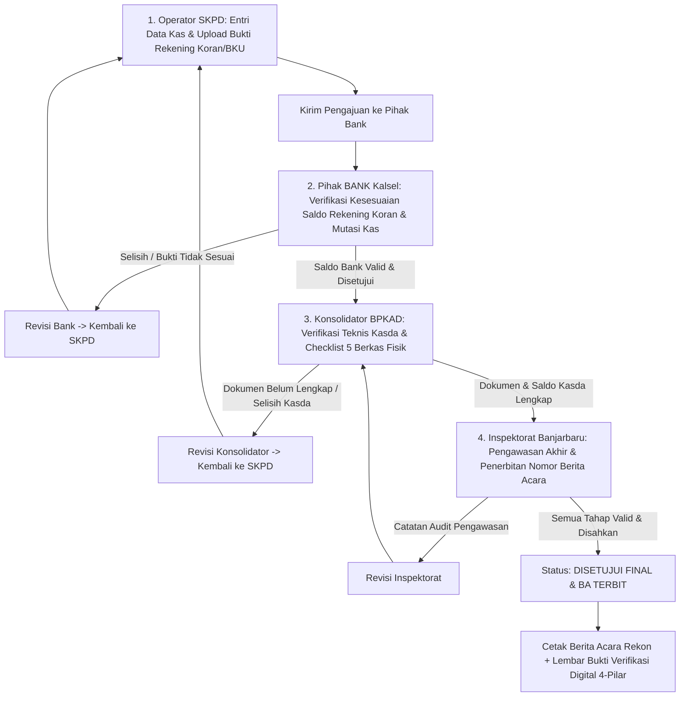

# PROJECT CONTEXT: SiReKa Kota Banjarbaru (sirekabjb)

## 1. Identitas & Latar Belakang
- **Aplikasi**: Sistem Rekonsiliasi Kas (SiReKa) Kota Banjarbaru
- **Instansi Tujuan**: Badan Pengelolaan Keuangan dan Aset Daerah (BPKAD) Pemerintah Kota Banjarbaru
- **Instansi Asal (Basis Engine)**: BPKAD Pemerintah Kabupaten Tapin (v2.4.0)
- **Direktori Lokal**: `/Users/rullyperdhana/Documents/antigravity folder/sirekabjb`
- **Repositori Git**:
  - `origin`: `https://github.com/rullyperdhana/sirekabjb.git` (Projek Utama Banjarbaru)
  - `upstream`: `https://github.com/rullyperdhana/rekonkaske.git` (Basis Engine Tapin)
- **Database Lokal**: `sirekabjb_db` (MySQL Socket MAMP)
- **Framework**: Laravel 11 / PHP 8.2+

---

## 2. Model Bisnis & Alur Verifikasi Berjenjang 4-Pilar (Pemko Banjarbaru)
Sistem menerapkan tata kelola rekonsiliasi kas daerah berjenjang 4-pilar dengan jejak audit forensik digital (*digital audit trail*):

### Hak Akses Pengguna (Roles):
1. **Admin (`admin`)**:
   - Manajemen instansi SKPD, user, pengaturan global, kunci periode rekonsiliasi, reset data, manajemen storage (Lokal/NAS/S3), kontrol registrasi mandiri, dan pengaturan pola nomor Berita Acara.
2. **Operator SKPD (`operator`)**:
   - Entri transaksi kas bulanan, input saldo bank, upload berkas pendukung (Rekening Koran, BKU, Register Kas, Berita Acara Kas), cetak Berita Acara, pratinjau timeline verifikasi.
3. **Pihak Bank (`bank` - Bank Kalsel Cabang Banjarbaru)**:
   - Verifikasi kesesuaian nilai rekening koran dan mutasi kas bank, persetujuan/catatan revisi bank terhadap transaksi SKPD.
4. **Konsolidator BPKAD (`konsolidator`)**:
   - Verifikasi teknis Kasda, checklist 5 butir kelengkapan berkas fisik/digital, penerbitan catatan per butir dokumen, tanda bukti verifikasi digital konsolidator.
5. **Inspektorat Kota Banjarbaru (`inspektorat`)**:
   - Pengawasan kepatuhan akhir, audit internal, pengesahan final rekonsiliasi, dan penerbitan nomor Berita Acara (BA).

---

## 3. Fitur Utama & Kustomisasi Khusus Pemko Banjarbaru

### A. Penomoran Berita Acara (BA) Dinamis (`BaNumberService`)
- Format nomor BA dapat diatur dinamis melalui menu Pengaturan Instansi / Global (`pengaturan.format_nomor_ba`).
- Format standar Banjarbaru: `900/{NOMOR}/BA-REKON/{KODE_SKPD}/{BULAN_ROMAWI}/{TAHUN}`.
- Mendukung tag otomatis:
  - `{NOMOR}` : Nomor urut Berita Acara otomatis per tahun (atau format manual).
  - `{KODE_SKPD}` : Kode instansi resmi SKPD (contoh: `1.01.0.00.0.00.01.0000`).
  - `{BULAN}` : Angka bulan dua digit (`01`, `02`, ..., `12`).
  - `{BULAN_ROMAWI}` : Format angka romawi bulan (`I`, `II`, ..., `XII`).
  - `{TAHUN}` : Tahun periode rekonsiliasi (`2026`).

### B. Jejak Audit Forensik & Verifikasi Log (`VerifikasiLog`)
- Setiap aksi persetujuan, penolakan, atau revisi dari Bank, Konsolidator, maupun Inspektorat terekam dalam tabel `verifikasi_logs`.
- Kolom tercatat: `transaksi_id`, `user_id`, `role`, `status_sebelumnya`, `status_baru`, `catatan`, `digital_seal` (SHA-256 hash stempel digital), dan `waktu_eksekusi`.
- Lembar Bukti Verifikasi Digital 4-Pilar menyertakan QR Code verifikasi dan rincian timestamp dari masing-masing verifikator.

### C. Autentikasi Dua Faktor (2FA - Two-Factor Authentication TOTP)
- Berbasis standar industri **RFC 6238 TOTP** (kompatibel dengan Google Authenticator, Microsoft Authenticator, 1Password, Authy).
- QR code digenerate langsung ke SVG vektor murni (menggunakan pustaka `bacon/bacon-qr-code`) tanpa ketergantungan pada Google Charts API pihak ketiga yang berisiko offline/dibatasi jaringan kedinasan.
- Dilengkapi **8 Recovery Emergency Codes** terenkripsi bcrypt untuk login darurat jika perangkat hilang.
- Layar tantangan 2FA (*Two-Factor Challenge Screen*) terintegrasi saat user dengan 2FA aktif melakukan login.

### D. Redesain Halaman Login (Center Card & Golden Fireflies Animation)
- **Tata Letak**: Menggunakan posisi simetris di tengah layar (*center page*), responsif penuh untuk layar mobile smartphone maupun desktop monitor lebar.
- **Latar Belakang**: Gradient biru tua kedinasan khas Pemerintah Kota Banjarbaru (`#001938` ke `#00346f`).
- **Efek Animasi**: Animasi Kunang-Kunang Emas (*Bioluminescent Golden Fireflies*) berbasis HTML5 Canvas kustom 60 FPS yang ringan, tanpa gambar AI dan tanpa dependensi eksternal.
- **Pembersihan Branding**: Bebas dari slogan-slogan yang tidak relevan (seperti slogan non-resmi), menjaga wibawa instansi resmi BPKAD Pemko Banjarbaru.

### E. Halaman Registrasi Operator SKPD (Constellation Mesh & Grab Mode 160px)
- **Komponen Interaktif**: Dropdown pencarian instansi SKPD dengan TomSelect (hanya menampilkan SKPD yang belum memiliki operator aktif).
- **Efek Jaringan Konstelasi**: Partikel mesh constellation bergerak perlahan (`speed: 1.8`).
- **Mode Interaktivitas Grab 160px**:
  - Menggunakan deteksi seluruh jendela (`detect_on: "window"`).
  - Garis-garis putih otomatis menghubungkan partikel di sekitarnya dalam radius 160px ke titik kursor mouse.
  - Dilengkapi jembatan sinkronisasi *touch screen* (`touchstart`, `touchmove`, `touchend`) sehingga berfungsi interaktif pada perangkat layar sentuh/ponsel.

### F. Master Data 87 SKPD Pemerintah Kota Banjarbaru
- Import dan seeder dari berkas master `kodeskpdbjb.xlsx` ke tabel `instansis` melalui `SkpdBanjarbaruSeeder`.
- Meliputi Sekretariat Daerah, Dinas, Badan, Kecamatan, Kelurahan, Rumah Sakit Daerah Idaman, dan seluruh unit kerja di lingkungan Pemko Banjarbaru.

---

## 4. Struktur Database Utama
- `users`: id, name, username, email, password, role (`admin`, `operator`, `bank`, `konsolidator`, `inspektorat`), skpd_id, nip, jabatan, no_hp, two_factor_secret, two_factor_recovery_codes, two_factor_confirmed_at.
- `instansis`: id, nama_instansi, kode_instansi, alamat, nama_bendahara, nip_bendahara, nomor_rekening, dll.
- `transaksis`: id, skpd_id, bulan, tahun, saldo_awal_bank, saldo_akhir_bank, saldo_kasda, status_verifikasi, verified_bank_by, verified_bank_at, verified_konsolidator_by, verified_konsolidator_at, verified_inspektorat_by, verified_inspektorat_at, nomor_ba, tanggal_ba.
- `catatan_revisi_verifikasi`: id, transaksi_id, skpd_id, user_id, role_verifikator, item_kategori, catatan, status_penyelesaian.
- `verifikasi_logs`: id, transaksi_id, user_id, role, status_sebelumnya, status_baru, catatan, digital_seal, ip_address, user_agent, created_at.
- `pengaturans`: id, skpd_id (nullable untuk global), logo, nama_aplikasi, format_nomor_ba, allow_skpd_download_ba, allow_reupload, lockdown_mode, storage_driver, dll.

---

## 5. Direktori & Berkas Penting
- **Pengaturan & Auth**:
  - `app/Http/Controllers/Auth/AuthenticatedSessionController.php` (Login & intercept 2FA)
  - `app/Http/Controllers/Auth/TwoFactorController.php` (Setup, QR Code, Recovery Codes)
  - `app/Http/Controllers/PengaturanController.php` & `app/Services/BaNumberService.php` (Pengaturan BA Dinamis)
- **Verifikasi 4-Pilar**:
  - `app/Http/Controllers/VerifikasiBankController.php`
  - `app/Http/Controllers/BaController.php` (Konsolidator)
  - `app/Http/Controllers/VerifikasiInspektoratController.php`
  - `app/Models/VerifikasiLog.php`
- **Tampilan Antarmuka**:
  - `resources/views/auth/login.blade.php` (Center Card & Golden Fireflies Animation)
  - `resources/views/auth/register.blade.php` (Mesh Network Constellation with Grab 160px)
  - `resources/views/auth/two-factor-challenge.blade.php`
  - `resources/views/profile/two-factor.blade.php`
  - `resources/views/laporan/bukti_verifikasi_digital_pdf.blade.php`
  - `resources/views/laporan/ba/pdf.blade.php`
