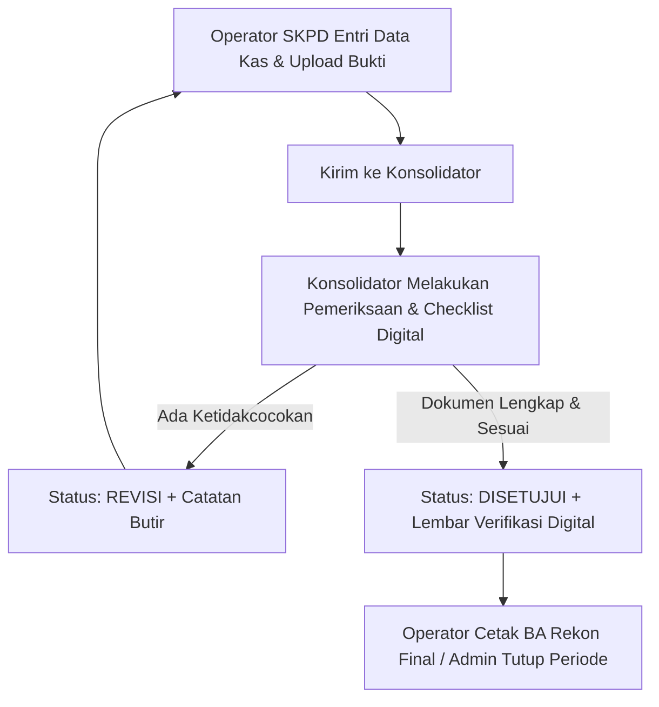

# PROJECT CONTEXT: SiReKa Kota Banjarbaru (sirekabjb)

## 1. Identitas & Latar Belakang
- **Aplikasi**: Sistem Rekonsiliasi Kas (SiReKa)
- **Instansi Asal (Basis Engine)**: BPKAD Pemerintah Kabupaten Tapin (v2.4.0)
- **Instansi Tujuan**: Pemerintah Kota Banjarbaru
- **Direktori Lokal**: `/Users/rullyperdhana/Documents/antigravity folder/sirekabjb`
- **Repositori Git**:
  - `origin`: `https://github.com/rullyperdhana/sirekabjb.git` (Projek Utama Banjarbaru)
  - `upstream`: `https://github.com/rullyperdhana/rekonkaske.git` (Basis Engine Tapin)
- **Database Lokal**: `sirekabjb_db` (MySQL Socket MAMP)

---

## 2. Fitur yang Sudah Ada dari Basis Engine (v2.4.0)
1. **Multi-Role Access Control**:
   - `admin`: Manajemen instansi, user, rekening koran, kunci periode rekonsiliasi, reset data, toggle izin unduh BA.
   - `operator`: Entri data transaksi, mutasi kas, saldo rekening bank per SKPD, cetak BA Rekonsiliasi, preview timeline revisi.
   - `konsolidator`: Verifikasi berkas SKPD, checklist digital dokumen kelengkapan (Hardcopy BA, Saldo Rekening, Register Kas, Berita Acara Kas, Catatan Lainnya), catatan revisi per butir dokumen, tanda bukti verifikasi digital.
2. **Riwayat Catatan Revisi & Verifikasi Digital**:
   - Kolom status verifikasi: `status_verifikasi` (`belum_diperiksa`, `revisi`, `disetujui`).
   - Riwayat catatan revisi: Tabel `catatan_revisi_verifikasi` (menyimpan riwayat revisi multi-entri per SKPD & per transaksi).
   - Pengaturan download BA SKPD: Setting `allow_skpd_download_ba` di tabel `pengaturan_aplikasi` (jika OFF, operator SKPD tidak dapat mendownload BA sebelum disetujui konsolidator).
3. **Cetak Dokumen & Berita Acara**:
   - Cetak Berita Acara Rekonsiliasi (PDF Dompdf).
   - Cetak Rekapitulasi Kas & Saldo.
   - Cetak Lembar Verifikasi Digital Konsolidator lengkap dengan status checklist kelengkapan dan QR/Tanda Bukti Digital.

---

## 3. Struktur Database Utama
- `users`: id, name, username, password, role (`admin`, `operator`, `konsolidator`), id_instansi, nip, jabatan, no_hp, dll.
- `instansi`: id, nama_instansi, kode_instansi, alamat, nama_bendahara, nip_bendahara, dll.
- `transaksi`: id, id_instansi, bulan, tahun, saldo_awal_bank, saldo_akhir_bank, status_verifikasi, verified_by, verified_at, dll.
- `transaksi_detail`: id, id_transaksi, tanggal, no_bukti, uraian, nominal_masuk, nominal_keluar, jenis, dll.
- `catatan_revisi_verifikasi`: id, id_transaksi, id_instansi, id_konsolidator, item_kategori, catatan, status_penyelesaian, created_at.
- `pengaturan_aplikasi`: key-value settings (logo, nama instansi, allow_skpd_download_ba, dll).

---

## 4. Alur Kerja Standar (Workflow Existing)

---

## 5. Rencana Kustomisasi Khusus Pemko Banjarbaru
- Penyesuaian nama instansi, logo, kop surat, dan penandatangan dokumen (Pemko Banjarbaru).
- Penambahan tahapan/alur baru sesuai kebutuhan regulasi Pemko Banjarbaru (misal: verifikasi berjenjang Kasubag/Kabid/Inspektorat atau integrasi khusus).
- Penyesuaian skema penomoran Berita Acara & format pelaporan.
